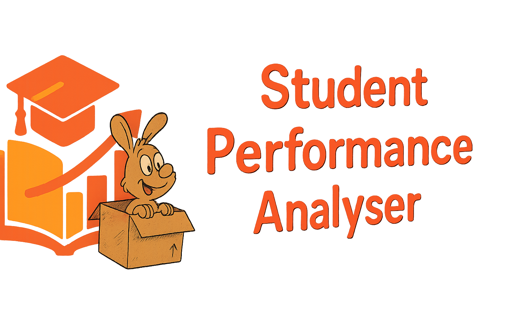
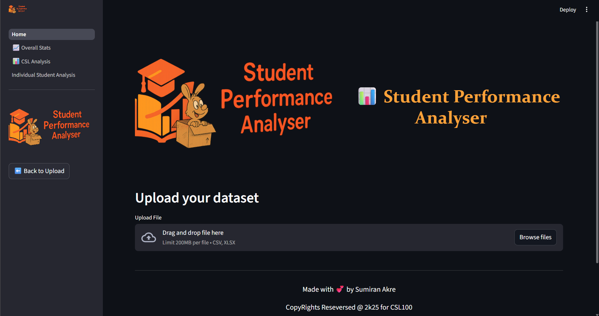
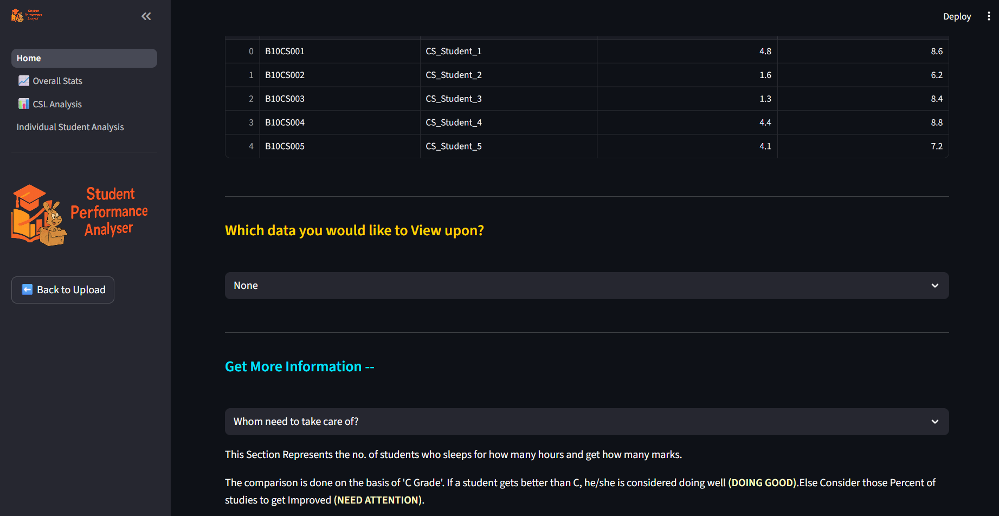
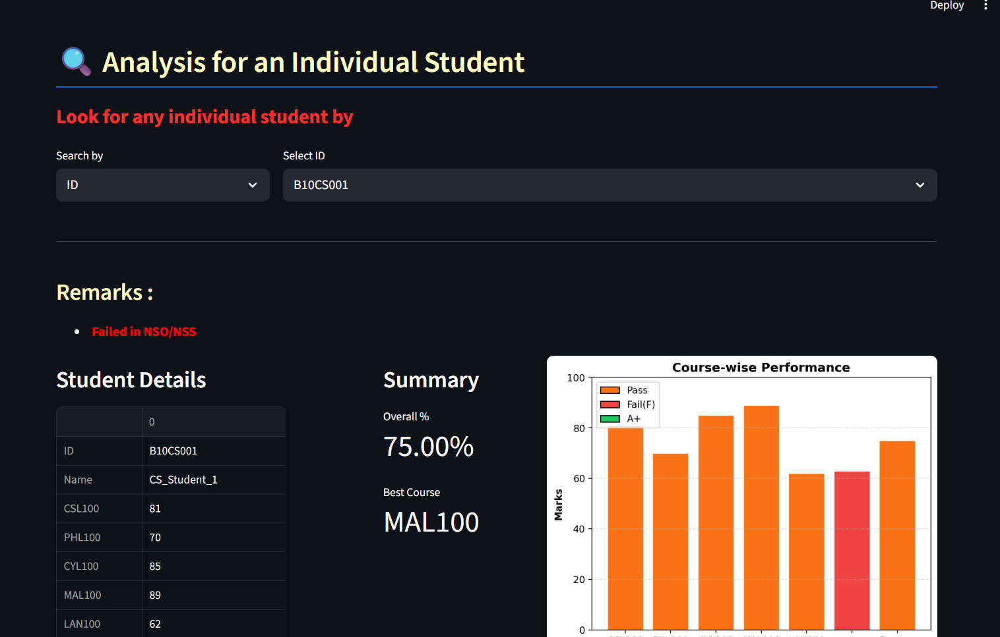

# 📊 Student Performance Analyser — README

A simple and modular data‑analysis dashboard built using Python and Streamlit. This project is designed for exploring datasets, computing statistics, visualising patterns, and generating insights with minimal setup.

This is a Streamlit-based dashboard. I built to analyse student performance in a clean, visual, and interactive way.
The idea is simple: upload a CSV or Excel file, and the app breaks down everything — overall performance, CSL100 specific  analysis, and even detailed individual student insights.

It’s mainly designed around the My own Structure of data, but as long as your dataset has the required columns, it will work fine.
Currently it works on the 14 Columns of dataset that I have used.
All the datasets are being provided for the testing of the Project.

---

## **📦 Features**

* Load and preview datasets
* Clean and preprocess data
* Generate descriptive statistics
* Interactive charts and visualisations
* Individual and overall student analysis features
* Fast and responsive Streamlit UI

---

## Tech Stack

**NUMPY** -- For math support\
**PANDAS** -- For making DataFrames and dealing with DataFrames\
**MATPLOTLIB** -- For constructing all the visual graphs, pie chats and donut charts\
**SCIKIT-LEARN** -- For Data Preprocessing\

---

## **🚀 Run Locally**

Follow these steps to set up and run the project on your machine.

### **1. Clone the repository**

```bash
git clone https://github.com/SumiRann1/Data-Analysis-and-Visualisation-Project.git
```

### **2. Go to the project directory**

```bash
cd Data-Analysis-and-Visualisation-Project
```

### **3. Open Virtual Environment**

```bash
python -m venv venv
```

### **4. Activate the Virtual Environment**

for Linux/MacOS
```bash
source venv/bin/activate
```
or 
for Windows
```bash
venv\Scripts\activate
```

### **5. Install dependencies**

Make sure Python 3.10+ is installed. Then install all required packages:

```bash
pip install matplotlib scikit-learn pandas numpy streamlit openpyxl
```
or
```bash
pip install -r requirements.txt
```

### **6. Start the server**

Run the Streamlit development server:

```bash
streamlit run Home.py
```
---

## **📁 Project Structure**

```
project/
│
├── Home.py                    # Entry point for Streamlit app
├── pages/                     # Additional Streamlit pages
├── requirements.txt           # List of Python dependencies
└── README.md                  # Documentation
```

---

## **🛠 Technologies Used**

* **Python**
* **Streamlit**
* **Pandas**
* **NumPy**
* **Matplotlib**

---
## Screenshots

   
Screenshot 1                                    Screenshot 2


Screenshot 3


Screenshot 4


## **📄 License**

This project is open-source. Use it freely for learning, analysis, and development.
Made for My First Semester Course Project.

---

